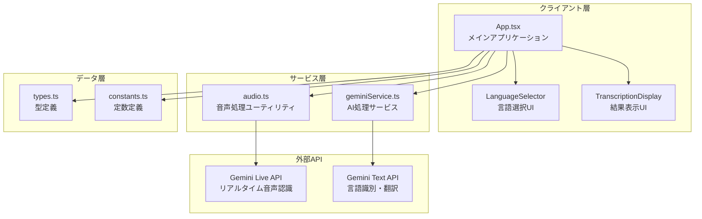
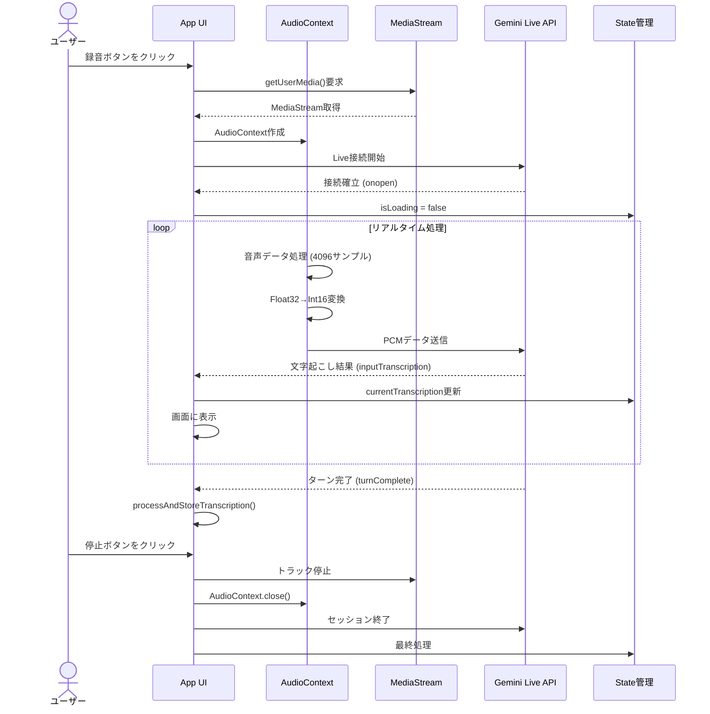
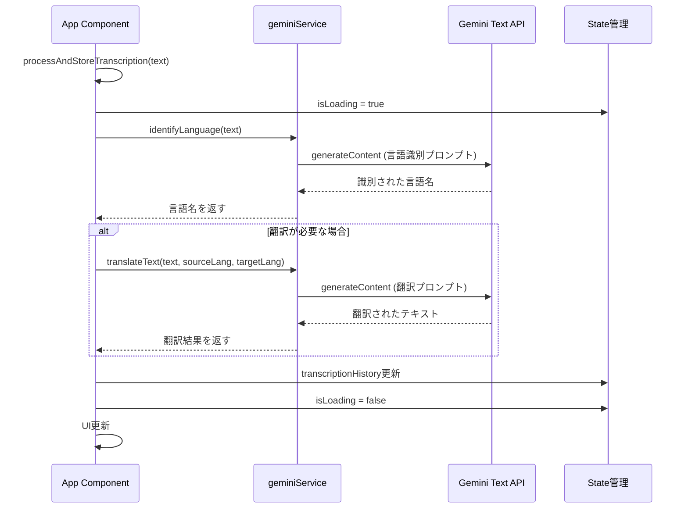
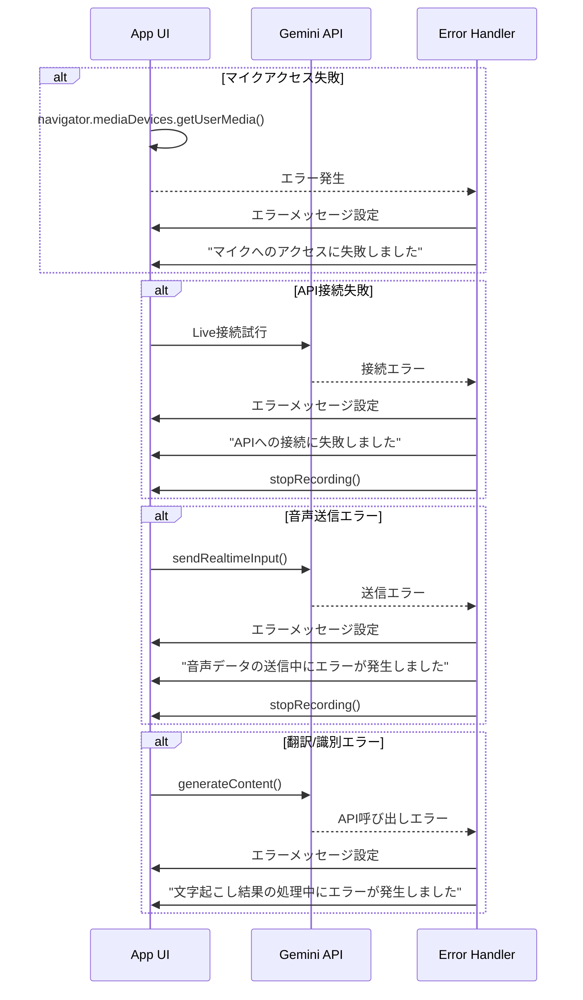

# リアルタイム文字起こし＆翻訳アプリ 仕様書

## 概要

本アプリケーションは、Google Gemini APIを利用したリアルタイム音声認識および翻訳システムです。ユーザーの音声をリアルタイムでテキストに変換し、選択した言語に自動翻訳します。

## システムアーキテクチャ

### コンポーネント構成



### 主要モジュール

#### 1. App.tsx
- **役割**: アプリケーションのメインコンポーネント
- **責務**:
  - UI状態管理
  - 録音の開始/停止制御
  - リアルタイム音声ストリーミング
  - 文字起こし結果の管理
  - 言語設定の管理

#### 2. services/geminiService.ts
- **役割**: Gemini APIとの連携処理
- **機能**:
  - `identifyLanguage(text: string)`: テキストの言語を識別
  - `translateText(text: string, sourceLang: string, targetLang: string)`: テキストを翻訳

#### 3. utils/audio.ts
- **役割**: 音声データ処理
- **機能**:
  - `encode(bytes: Uint8Array)`: バイト配列をBase64エンコード
  - `createBlob(data: Float32Array)`: 音声データをGemini API形式に変換

#### 4. types.ts
- **型定義**:
  - `Language`: 言語コードと名前
  - `Transcription`: 文字起こし結果

#### 5. constants.ts
- **定数**:
  - `LANGUAGE_LIMIT`: 認識可能な最大言語数 (3)
  - `SUPPORTED_LANGUAGES`: サポート言語リスト (12言語)

## データモデル

### Language型

```typescript
interface Language {
  code: string;      // 言語コード (例: 'ja-JP', 'en-US')
  name: string;      // 言語名 (例: '日本語', 'English')
}
```

### Transcription型

```typescript
interface Transcription {
  originalText: string;      // 元のテキスト
  sourceLang: string;        // 識別された言語
  translatedText?: string;   // 翻訳されたテキスト（任意）
  targetLang?: string;       // 翻訳先言語（任意）
  timestamp: string;         // タイムスタンプ (ISO 8601形式)
}
```

## 主要なユースケース

### 1. リアルタイム文字起こし



### 2. 言語識別と翻訳



### 3. エラーハンドリング



## 状態管理

### アプリケーション状態

```typescript
// UI状態
const [isRecording, setIsRecording] = useState(false);      // 録音中フラグ
const [isLoading, setIsLoading] = useState(false);          // ロード中フラグ
const [error, setError] = useState<string | null>(null);    // エラーメッセージ

// 言語設定
const [sourceLanguages, setSourceLanguages] = useState<Language[]>([...]);  // 識別する言語
const [targetLanguage, setTargetLanguage] = useState<Language>({...});      // 翻訳先言語

// 文字起こし結果
const [currentTranscription, setCurrentTranscription] = useState('');                    // 現在の文字起こし
const [transcriptionHistory, setTranscriptionHistory] = useState<Transcription[]>([]);   // 履歴

// Ref (参照)
const sessionPromiseRef = useRef<Promise<any> | null>(null);              // Live APIセッション
const audioContextRef = useRef<AudioContext | null>(null);                // 音声コンテキスト
const scriptProcessorRef = useRef<ScriptProcessorNode | null>(null);      // 音声プロセッサー
const mediaStreamRef = useRef<MediaStream | null>(null);                  // メディアストリーム
const currentTranscriptionRef = useRef('');                                // 現在の文字起こし（参照用）
const isRecordingActiveRef = useRef(false);                                // 録音状態（参照用）
```

## API仕様

### Gemini Live API

- **モデル**: `gemini-2.5-flash-native-audio-preview-09-2025`
- **設定**:
  - `inputAudioTranscription`: 有効化
  - `responseModalities`: `[Modality.AUDIO]`
  - `systemInstruction`: カスタム指示
- **音声形式**: PCM, 16000Hz, 16bit, モノラル

### Gemini Text API

- **モデル**: `gemini-2.5-flash`
- **用途**:
  - 言語識別
  - テキスト翻訳

## 機能要件

### FR-01: 音声録音
- ユーザーはマイクボタンをクリックして録音を開始できる
- 録音中は停止ボタンが表示される
- マイクへのアクセス許可が必要

### FR-02: リアルタイム文字起こし
- 音声は16kHzでサンプリングされる
- 4096サンプルごとにGemini APIに送信される
- 文字起こし結果はリアルタイムで表示される

### FR-03: 言語識別
- 最大3つの言語を識別対象として設定可能
- 12の言語がサポートされる
- 文字起こし後、自動で言語を識別

### FR-04: 翻訳
- 翻訳先言語を選択可能
- 元の言語と異なる場合のみ翻訳を実行
- 翻訳結果は元のテキストと共に表示

### FR-05: 結果表示
- 現在の文字起こし中のテキストは点滅表示
- 過去の文字起こし結果は履歴として表示
- 各結果には言語名とタイムスタンプが含まれる

## 非機能要件

### NFR-01: パフォーマンス
- リアルタイム処理のため、音声データの遅延は最小限に抑える
- UIは応答性を保つ

### NFR-02: エラーハンドリング
- すべてのAPI呼び出しはエラーハンドリングを実装
- エラーメッセージはユーザーフレンドリーな日本語で表示

### NFR-03: リソース管理
- 録音停止時、すべてのリソース（AudioContext、MediaStream等）を適切に解放
- メモリリークを防ぐためにクリーンアップを実装

### NFR-04: セキュリティ
- API キーは環境変数で管理
- クライアント側でのみ使用（本番環境では要注意）

## 技術スタック

- **フレームワーク**: React 19.2.0
- **言語**: TypeScript 5.8.2
- **ビルドツール**: Vite 6.2.0
- **AI API**: Google Gemini API (@google/genai 1.29.1)
- **音声API**: Web Audio API (AudioContext, ScriptProcessorNode)
- **メディアAPI**: MediaStream API (getUserMedia)
- **スタイリング**: Tailwind CSS (utility classes)

## 環境変数

- `API_KEY`: Gemini APIキー（必須）

## ビルド・デプロイ

```bash
# 依存関係のインストール
npm install

# 開発サーバー起動
npm run dev

# プロダクションビルド
npm run build

# プレビュー
npm run preview
```

## 制限事項

1. **ブラウザ互換性**: Web Audio APIとMediaStream APIをサポートするモダンブラウザが必要
2. **マイク権限**: ユーザーはマイクへのアクセスを許可する必要がある
3. **ネットワーク**: リアルタイム処理のため、安定したインターネット接続が必要
4. **API制限**: Gemini APIの使用量制限に依存
5. **音声プロセッサー**: ScriptProcessorNodeは非推奨だが、互換性のため使用（将来的にはAudioWorkletへの移行を推奨）

## 今後の改善案

1. **AudioWorkletへの移行**: ScriptProcessorNodeの代わりにAudioWorkletを使用
2. **オフライン対応**: Service Workerを使用したオフライン機能
3. **履歴の永続化**: LocalStorageやIndexedDBを使用した履歴の保存
4. **エクスポート機能**: 文字起こし結果のテキストファイルエクスポート
5. **カスタマイズ**: UI テーマの選択、フォントサイズの調整
6. **音声フィードバック**: 翻訳結果の音声読み上げ
7. **バックエンド統合**: APIキーをサーバー側で管理
